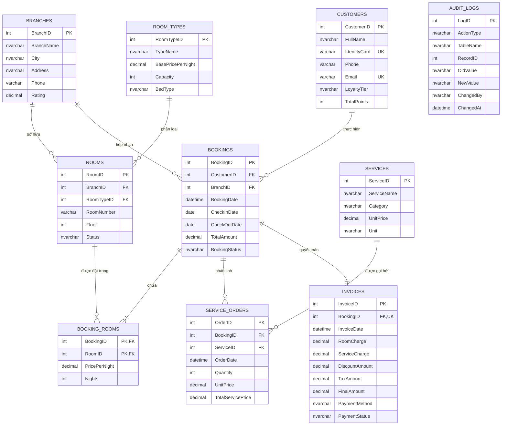

# 🏨 Hotel Booking System Database (Microsoft SQL Server)

> **Dự án Môn học:** Thực hành Cơ sở dữ liệu (Database Systems Lab)  
> **Hệ quản trị CSDL:** Microsoft SQL Server (T-SQL)  
> **Mô hình triển khai:** Chuỗi Khách sạn Đa Chi nhánh (Multi-Branch Hotel Chain Management)

---

## 📌 1. Giới thiệu Dự án

Dự án thiết kế và cài đặt hệ thống Cơ sở dữ liệu quan hệ cho **Chuỗi Khách sạn & Nghỉ dưỡng Cao cấp**, bao gồm toàn bộ chu trình quản lý:
- Quản lý danh mục Chi nhánh, Hạng phòng, Phòng và Danh mục Dịch vụ.
- Quản lý Khách hàng và cơ chế Khách hàng Thân thiết (**Loyalty Program**).
- Quy trình Đặt phòng (**Booking**), Nhận phòng (**Check-in**), Gọi Dịch vụ (**Service Orders**), Trả phòng & Xuất hóa đơn (**Check-out & Invoicing**).
- Hệ thống Khung nhìn (**Views**), Hàm nghiệp vụ (**Functions**), Thủ tục giao dịch (**Stored Procedures with ACID Transactions**), Bộ kích hoạt tự động (**Triggers**) và Tối ưu hóa Chỉ mục (**Index Tuning**).

---

## 🏛️ 2. Sơ đồ Thực thể Quan hệ (Mermaid ERD)



---

## 📂 3. Cấu trúc Thư mục

```text
hotel-booking-database-sqlserver/
├── docs/
│   └── database_design_guide.md      # Tài liệu thiết kế CSDL, chứng minh 3NF, quy trình
├── sql/
│   ├── 00_all_in_one_install.sql     # Master Script 1-Click cài đặt toàn bộ hệ thống
│   ├── 00_run_all_setup.sql          # Hướng dẫn chạy và danh mục kịch bản
│   ├── 01_schema_and_tables.sql      # 10 Bảng quan hệ & Ràng buộc toàn vẹn (PK, FK, CHECK, UK)
│   ├── 02_seed_sample_data.sql       # Dữ liệu mẫu chuẩn tiếng Việt cho 5 chi nhánh
│   ├── 03_views.sql                  # 4 Khung nhìn phân tích báo cáo (Views)
│   ├── 04_functions.sql              # 4 Hàm người dùng (Scalar & Table-Valued Functions)
│   ├── 05_stored_procedures.sql      # 5 Thủ tục lưu trữ xử lý luồng đặt/trả phòng (Transactions)
│   ├── 06_triggers.sql               # 4 Triggers kiểm soát chống trùng lịch & tích điểm
│   ├── 07_advanced_queries.sql       # 16 Truy vấn nâng cao (CTE, Window Functions, LAG/LEAD)
│   └── 08_indexes_and_tuning.sql     # Nonclustered Indexes, Filtered Indexes & Tuning
├── .gitignore                        # Cấu hình bỏ qua file tạm SQL Server
└── README.md                         # Tài liệu thuyết minh dự án
```

---

## 🚀 4. Hướng dẫn Cài đặt & Chạy trên SSMS (SQL Server Management Studio)

### Cách 1: Cài đặt All-In-One (Nhanh nhất & Đơn giản nhất)
1. Mở công cụ **SQL Server Management Studio (SSMS)** và kết nối vào Server của bạn.
2. Mở file: `sql/00_all_in_one_install.sql`.
3. Nhấn **Execute (F5)**. Toàn bộ CSDL `HotelBookingDB`, 10 bảng, dữ liệu mẫu, Views, Functions, Stored Procedures, Triggers và Indexes sẽ được khởi tạo tự động.

### Cách 2: Chạy từng Script theo tiến trình học tập
Chạy lần lượt các file trong thư mục `sql/` theo thứ tự:
1. `01_schema_and_tables.sql`
2. `02_seed_sample_data.sql`
3. `03_views.sql`
4. `04_functions.sql`
5. `05_stored_procedures.sql`
6. `06_triggers.sql`
7. `07_advanced_queries.sql` (Chạy thử nghiệm các câu query thống kê & báo cáo)
8. `08_indexes_and_tuning.sql`

---

## 💡 5. Tính năng Kỹ thuật Nổi bật trong Dự án

| Phân hệ / Kỹ thuật | Mô tả chi tiết |
| :--- | :--- |
| **Chuẩn hóa dữ liệu** | Chuẩn hóa 3NF tuyệt đối, triệt tiêu dư thừa dữ liệu và bất thường thêm/xóa/sửa. |
| **Views** | Thống kê phòng trống thời gian thực, lịch sử khách hàng, doanh thu theo chi nhánh. |
| **Functions** | `fn_CalculateCustomerDiscount`, `fn_CheckRoomAvailable`, `fn_GetBranchOccupancyRate`. |
| **Transactions & ACID** | Thủ tục `sp_CheckOutAndGenerateInvoice` và `sp_CreateBooking` sử dụng `TRY...CATCH` và `ROLLBACK TRANSACTION` đảm bảo toàn vẹn dữ liệu tài chính. |
| **Triggers** | `trg_PreventDoubleBooking` (ngăn đặt trùng phòng), `trg_UpdateCustomerLoyaltyOnInvoice` (tự động cộng điểm & thăng hạng VIP). |
| **Advanced Queries** | 16 câu truy vấn sử dụng `CTE`, Window Functions (`ROW_NUMBER`, `DENSE_RANK`, `LAG`, `LEAD`, `NTILE`), Moving Average và MoM Revenue Growth. |
| **Performance Tuning** | Áp dụng **Filtered Indexes** và **Covering Indexes (INCLUDE)** giúp tối ưu hóa IO và thời gian thực thi. |

---

## 👨‍💻 Tác giả
- Sinh viên ngành Công nghệ Thông tin
- Đồ án môn: **Thực hành Cơ sở dữ liệu**
